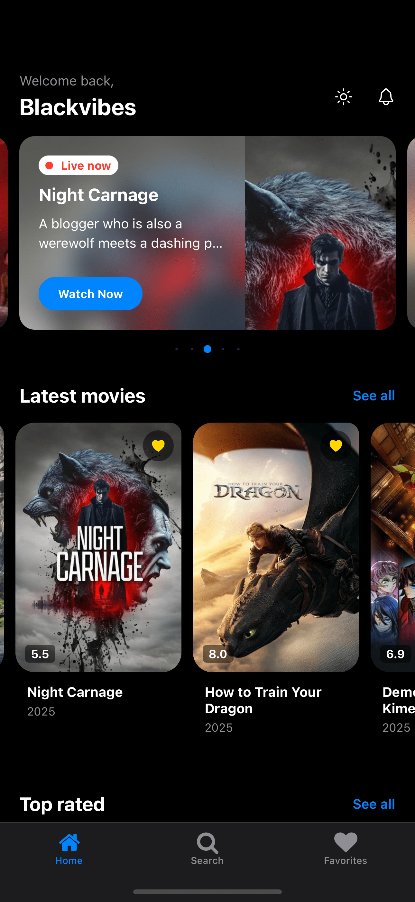
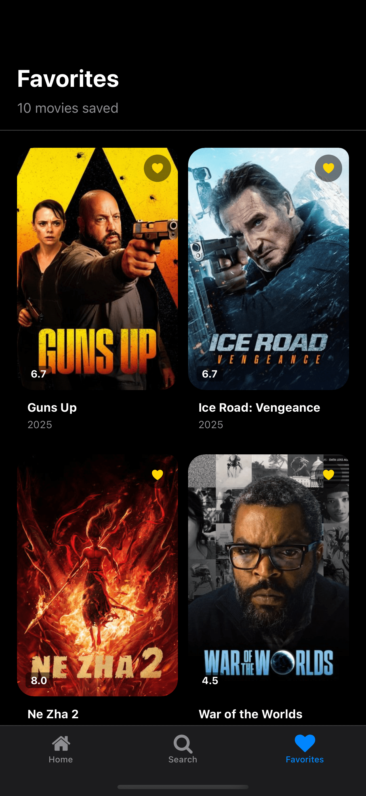
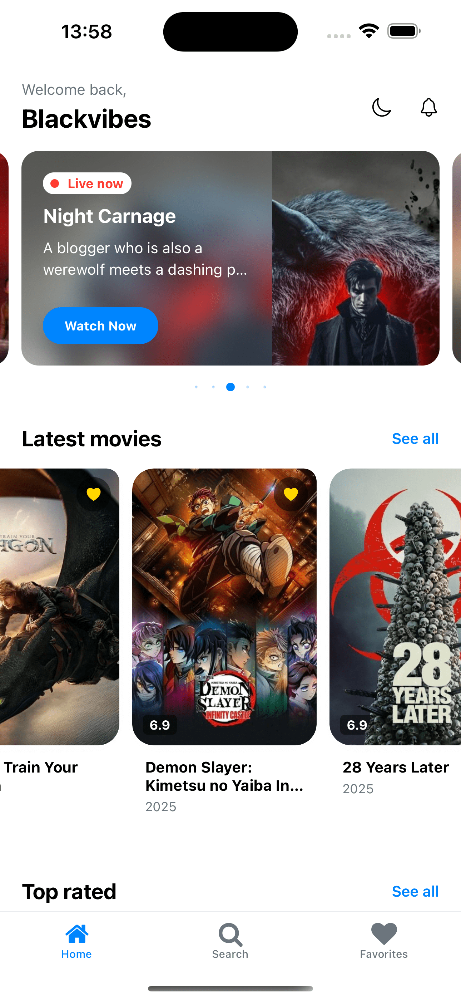

# Mephalti Technical Assessment - React Native CLI

This is a **React Native** project built using [`@react-native-community/cli`](https://github.com/react-native-community/cli) for the Mephalti technical assessment.

## Project Overview

This application demonstrates proficiency in React Native CLI development, showcasing modern mobile app development practices with native module integration capabilities.

---

## 📱 App Preview

<div align="center">
  
  
  
  
</div>

---

## Prerequisites

> **Note**: Make sure you have completed the [React Native Environment Setup](https://reactnative.dev/docs/set-up-your-environment) guide before proceeding.

Required tools:
- Node.js (v16 or higher)
- React Native CLI
- Android Studio (for Android development)
- Xcode (for iOS development, macOS only)
- CocoaPods (for iOS dependencies)

## Installation & Setup

### Step 1: Clone and Install Dependencies

```bash
# Clone the repository
git clone https://github.com/samuel-akinboro/mephalti-rn-cli.git
cd mephalti-rn-cli

# Install dependencies
npm install
# OR using Yarn
yarn install
```

### Step 2: iOS Setup (macOS only)

For iOS development, install CocoaPods dependencies:

```bash
# Install Ruby bundler (first time only)
bundle install

# Install iOS dependencies
cd ios && bundle exec pod install && cd ..
```

### Step 3: Start Metro

Start the Metro bundler:

```bash
# Using npm
npm start

# OR using Yarn
yarn start
```

## Running the Application

With Metro running, open a new terminal and run:

### Android

```bash
# Using npm
npm run android

# OR using Yarn
yarn android
```

### iOS

```bash
# Using npm
npm run ios

# OR using Yarn
yarn ios
```

If everything is set up correctly, you should see the app running in your emulator/simulator or connected device.

## Project Structure

```
mephalti-rn-cli/
├── android/                 # Android-specific files
├── ios/                     # iOS-specific files
├── src/                     # Source code
│   ├── components/          # Reusable components
│   ├── screens/            # App screens
│   ├── config/             # configuration
│   ├── constants/           # Themes/colors
│   ├── assets/              # Fonts and images
│   └── store/              # Zustand
├── App.tsx                 # Root component
└── package.json           # Dependencies and scripts
```

## Features

- Modern React Native CLI implementation
- TypeScript integration
- Component-based architecture
- Native module compatibility
- Performance optimized
- Cross-platform compatibility (iOS & Android)

## Development

### Hot Reload

The app supports Fast Refresh for quick development iterations:

- **Android**: Press <kbd>R</kbd> twice or <kbd>Ctrl</kbd> + <kbd>M</kbd> (Windows/Linux) / <kbd>Cmd ⌘</kbd> + <kbd>M</kbd> (macOS) for dev menu
- **iOS**: Press <kbd>R</kbd> in iOS Simulator

### Building for Production

```bash
# Android
npx react-native build-android

# iOS (requires Xcode)
npx react-native build-ios
```

## Technical Specifications

- **React Native CLI**: Latest stable version
- **TypeScript**: For type safety and better development experience
- **Architecture**: Component-based with separation of concerns
- **Platform**: Cross-platform (iOS & Android)
- **State Management**: Zustand (as applicable)
- **Navigation**: React Navigation v7